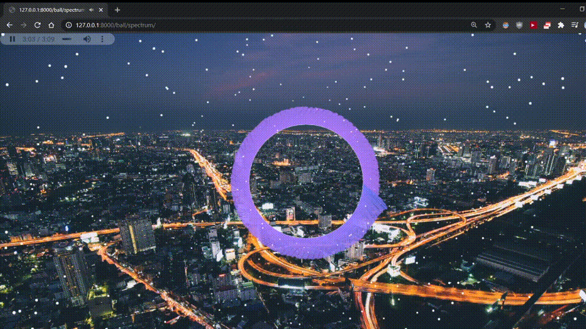

# Audio Visualization
Building a similar styled replica of audio visualizers used on YouTube channels like Trap Nation and Proximity.

Built Using
 - Web Audio API
 -  Javascript Canvas API
 - Keep a local copy of this repo and start a local server in that repo
	 Eg: from cmd`python -m http.server`
 - Go to 127.0.0.1:8000 in browser.
 - Click play button on top left of page.

An example output is shown below.

Photo by Florian Wehde
